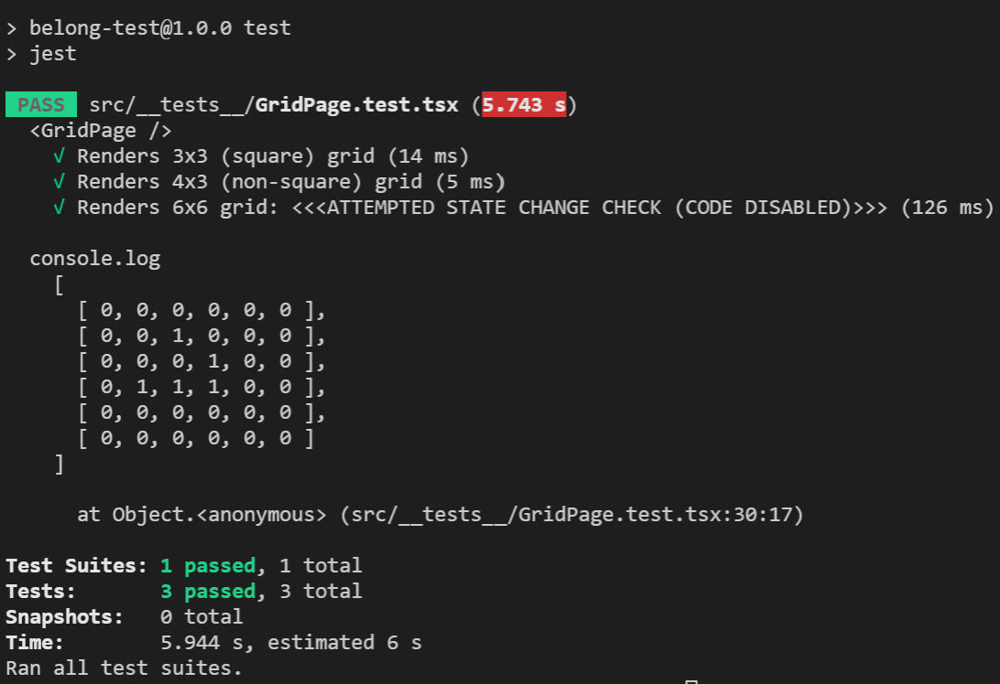
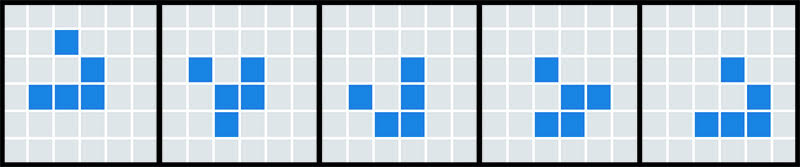

# Developer submission

**Creator:** Jaycee Phua

**Submission date:** Wed 29 Sept 2021

### Assessment requirements

|Feature|Implemented
|---|:---:
| *React* | ✔
| *TypeScript* | ✔[#] <br />(see *Developer notes* below)
| *Testing attempt* | ✔
| *Git History* | ✔

#### Repository 

**github**
: https://github.com/jcphua/belo-test/tree/master


#### Deployment 
**github pages**
: https://jcphua.github.io/belo-test/ 

## Details

### Front-end notes
* Grid size can be updated via browser querystring, where size can be passed using parameter "`grid=`*\<columns\>*`x`*\<rows\>*" (where the delimiter is the 'x' alphabetic character). 

    eg.

    ```
    https://jcphua.github.io/belo-test/?grid=30x20
    ```

    Optionally, specifying `rows` & `cols` parameters separately will override any reference to `grid` parameter.

    **By default, and if no parameters are specified, grid size will revert to size 6×6.**

    *Note:*
    > There is no maximum constraint imposed in code for rows or columns, and if grid is specified as excessively large, it will tax your system's processor, therefore discretion is advised on grid size

* The 'Next generation' button does not trigger if the Grid is empty.
* *The UI has not been set up to be responsive*, and so will remain a fixed layout regardless of the grid size.

### Developer notes
* Source code submitted for assessment is accessible in the repository as the `Master` branch.
* Source code has been written to comply with *TypeScript* in a simple form. 

    [\#] Some declarations were stripped to stop build issues once `Jest` and `Enzyme` tools were included.
* Minimal effort has been spent on CSS and browser compatibility intentionally due to time constraints. If more time available, proper inclusion and implementations of SCSS would be assured.
* Core Grid source code is located in `src/index.tsx` and `src/components/GridPage.tsx` files.
* **Testing results** can be generated from the command line as:

    ```
    npm run test
    ```

    An attempt to unit test successive generations of the grid has been included in the testing script (`src/__tests__/GridPage.test.tsx`), but has been deliberately commented out due to presumably current limitations with tools testing for React Hooks, set to return a false 'success'.

    Example output:

    


----

<!-- FRONT END ENGINEER/DEVELOPER -->

# Cell Simulator

The aim is to demonstrate how you approach thinking about problems and translating them to code.

Create a repository to your own, spend your allocated time working on a solution and then submit it back to us. Please include a README with installation and usage instructions.
 
**Challenge**
: *Cell Simulator*

The "game" is a zero-player game, meaning that its evolution is determined by its initial state, requiring no further input. One interacts with the Cell Simulator by creating an initial configuration and observing how it evolves.
 
Example: 
 
## Acceptance criteria

- At initial state, User should see an empty board.
- User can make Cells "alive".
- User can make Cells "dead".
- User can trigger "next generation".
- User can trigger a "reset" to the initial state.
 
## Next generation

- When the next generation is running:
    - A Cell with fewer than two live neighbours dies of under-population.
    - A Cell with 2 or 3 live neighbours lives on to the next generation.
    - A Cell with more than 3 live neighbours dies of overcrowding.
    - An empty Cell with exactly 3 live neighbours "comes to life".
    - A Cell who "comes to life" outside the board should wrap at the other side of the board.
- Once the next generation is done, User can trigger "next generation" again.
 
This example shows an initial state followed by 4 "next generations": 
 
## Requirements

- Use React and TypeScript.
- Please include some attempt at testing your code.
- While not mandatory, a meaningful git history will be looked upon favourably.
 
----

